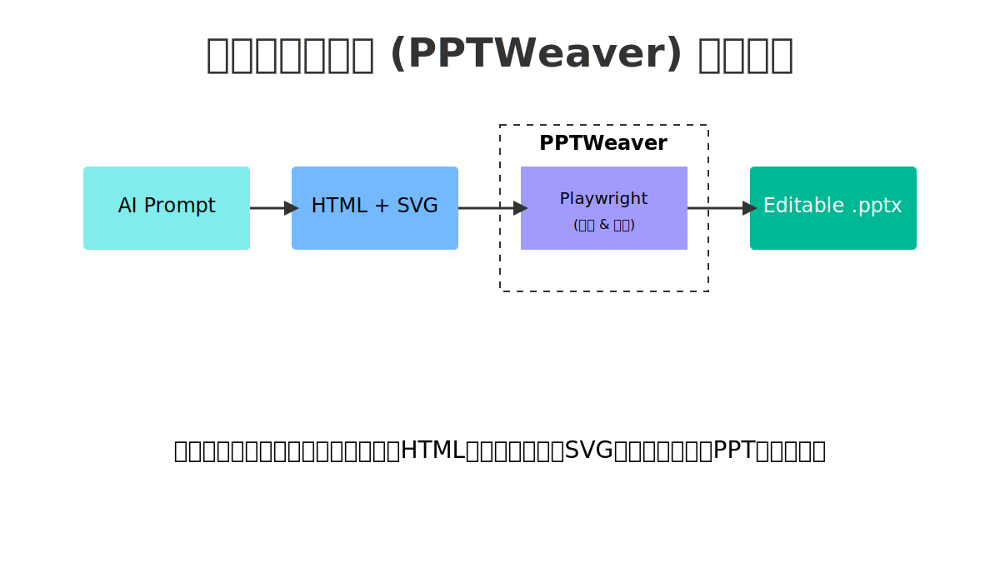

# 幻织 (PPTWeaver) ✨ - 我为连接 AI 与可编辑 PPT 所做的个人探索

你好！这是我的一个个人项目，它源于一个简单的问题：“我能让 AI 写出*真正可编辑*且**内容丰富**的 PowerPoint 幻灯片吗？” 

**中文** | [English](./README_en.md)

---

### 🤔 痛点：AI PPT 工具总感觉……差点意思

和许多人一样，我为 AI 生成内容的能力而着迷。但当我深入研究 AI PPT 生成器时，我发现它们大多属于以下几类，而且没有一类能完全满足我的需求：

1.  **模板填充型**: 这类工具接收你的文本，然后将其填充到预定义的模板中。速度很快，但在创意上限制很大。你没法让它生成一个复杂的、定制化的图表，因为 AI 只是在“填空”。
2.  **图片导出型**: 这类工具提供了更多的视觉自由度，但它们在“作弊”。它们将漂亮的幻灯片生成为静态图片或 PDF。这完全违背了 PowerPoint 的初衷——你什么都改不了！
3.  **封闭生态型**: 像 Microsoft Copilot 这样强大的工具与 Office 深度集成，但它们通常是付费的、闭源的商业产品。对于一个喜欢自己动手探索的开发者来说，它们就像一个黑盒。

### ✨ 灵光一现：AI 是 HTML & SVG 的大师

当我意识到我问错了问题时，真正的突破到来了。我不该问“AI，帮我做个 PPT”，而应该问“AI，帮我为 PPT *生成视觉元素*”。

事实证明，大语言模型在使用 HTML 和 SVG 生成复杂、精美且精确的视觉内容方面，能力**惊人**。这是它们能够原生理解的语言。突然之间，我找到了一种方法，可以创造出任何我能想象到的定制图表、图示或布局。

但这带来了新的挑战：你如何将这些完美的、基于 Web 的内容，转换成一个完全可编辑的 `.pptx` 文件呢？

### 🛠️ 我的解决方案：PPTWeaver 的工作流

这个项目就是我的答案。我不再将 AI 视为幻灯片设计师，而是将其视为一名前端开发人员。工作流程如下：



1.  **以 HTML/SVG 为源**: 我们从一个标准的 HTML 文件开始。每一个 `<body>` 标签都代表一张新的幻灯片。
2.  **使用无头浏览器渲染**: PPTWeaver 在后台使用 Playwright，像浏览器一样精确地渲染 HTML。这一步以完美的保真度捕获所有的 CSS 样式和布局信息。
3.  **提取与翻译**: 核心引擎会检查渲染好的页面，提取每一个 SVG 元素，并将其属性（位置、大小、颜色、文本）翻译成 `python-pptx` 库能理解的语言。
4.  **编织成 PPTX**: 最后，它将每个元素重构为原生的、可编辑的 PowerPoint 形状，从而将 Web 内容“编织”成最终的 `.pptx` 文件。

### 🏛️ 软件架构

这是一个更详细的内部组件协作图：


### 🎨 AI Prompt 模板

想让 AI 为你生成兼容 `pptweaver` 的 HTML 吗？试试下面的模板！关键在于引导 AI 像一名前端开发者一样思考，专注于生成结构清晰、带内联 SVG 的 HTML。

如果模型支持的上下文足够长，建议把这里的tests/samples作为示例丢给AI。

> **角色**: 你是一名精通 SVG 和数据可视化的前端开发专家。
>
> **任务**: 为一个 PowerPoint 演示文稿生成 `[幻灯片数量]` 张幻灯片的视觉内容。
>
> **格式要求**:
> 1.  提供一个**完整的 HTML 代码块**，无需额外的解释。
> 2.  每一张幻灯片的内容必须包含在一个独立的 `<body>` 标签中。整个文件可以有多个 `<body>` 标签。
> 3.  所有视觉元素**必须使用内联 SVG** 来创建。SVG 的 `width` 应为 `1200`，`height` 应为 `675`，以匹配 PowerPoint (16:9) 的宽高比。
> 4.  SVG 内部的元素应尽量使用基础形状（`<rect>`, `<circle>`, `<path>`, `<text>` 等），并使用内联 `fill`, `stroke`, `font-size` 等属性定义样式。避免使用复杂的 CSS 类或外部样式表。
> 5.  在 SVG 中恰当安排元素布局，确保视觉效果美观、清晰。
>
> **主题**: `[在这里描述你的幻灯片主题和内容]`
>
> **示例请求**:
> "我需要 3 张关于'项目管理铁三角'的幻灯片。第一张是标题页，第二张是核心图示，第三张是总结要点。"

### 🚀 来试试看！

**安装:**
```bash
# 安装主包
pip install pptweaver
# 安装 Playwright 依赖 (首次使用需要)
playwright install
```

**快速使用:**

***命令行使用:***
```bash
pptweaver your_slides.html -o presentation.pptx
```

***代码中使用:***
```python
import asyncio
from pptweaver import Converter

async def main():
    converter = Converter(input_file="your_slides.html", output_file="presentation.pptx")
    await converter.convert()

asyncio.run(main())
```
### 🚧 项目仍在施工中 & 未来计划

这个项目还远未完成！以下是路线图上的一个粗略想法：

-   [ ] **改进样式转换**: 更好地支持 CSS 渐变、阴影和复杂的文本样式。
-   [ ] **动画与过渡**: 为幻灯片过渡和简单的入场动画提供基础支持。
-   [ ] **交互式元素**: 探索将 HTML 链接或按钮映射到 PowerPoint 交互式元素的方法。
-   [ ] **从 Prompt 直达 PPTX**: 一个更高级的 API，与 LLM 集成，实现从文本提示直接生成最终的 PPTX 文件。
-   [ ] **更多处理器**: 支持更多小众的 SVG 标签和 CSS 属性。

### 🤝 一起玩吧！

这是一个个人项目，但我非常希望它能成为一个社区项目。如果你有任何想法、发现了 bug，或者想添加新功能，请随时开启一个 Issue 或提交一个 Pull Request！

